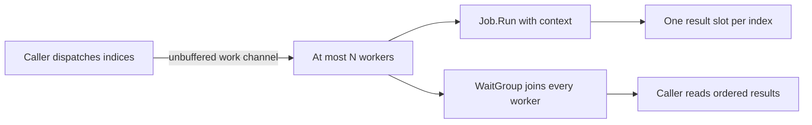

# Jobrunner — Lesson 1: own worker lifetimes

This is project two after `streamgrep`. It is a working local batch runner:
several timer jobs execute concurrently, at most a configured number at once.
The command waits for them all and prints results in input order.

This lesson primarily applies roadmap chapters 2, 3, 6, 8, 9, 10, 11 and 12.
See the [complete three-project curriculum](../docs/superpowers/specs/2026-10-09-jobrunner-design.md)
for every chapter's destination. The source now contains all five lessons;
this guide preserves the foundational walkthrough. Retries, signal handling,
streaming admission and profiling are explained in the later guides.

## Try it

Requires Go 1.27.0 or later. No third-party modules or external services.

```powershell
Set-Location C:\Users\user\personal\dev\go\jobrunner
go run . -workers 2 -jobs 6 -duration 100ms -timeout 2s
go run . -h
```

On macOS (zsh or bash), adjust the path to your checkout location:

```sh
cd ~/personal/dev/go/jobrunner
go run . -workers 2 -jobs 6 -duration 100ms -timeout 2s
go run . -h
```

The successful command prints:

```text
job 0: succeeded
job 1: succeeded
job 2: succeeded
job 3: succeeded
job 4: succeeded
job 5: succeeded
```

Now cancel the batch before the first jobs can finish:

In PowerShell or macOS Terminal (zsh or bash):

```sh
go run . -workers 2 -jobs 6 -duration 500ms -timeout 100ms
```

Typically jobs 0 and 1 say `canceled (started)`, and the rest say
`canceled (not started)`. Stderr reports `context deadline exceeded`.
Scheduling can affect how many jobs start; ordered output does not prove ordered
execution. `go run` also prints `exit status 1` for the child's failed status.
The executable itself returns 0 for success/help, 1 for failure/cancellation,
and 2 for invalid arguments. Output failures also return 1.

## Read the source in this order

1. `internal/runner/runner.go`: read Job and Result first, then Run's validation,
   workers, dispatcher and join. Run now delegates to RunWithOptions with zero
   options; focus on the base flow before studying policy in later lessons.
2. `internal/runner/example_test.go`: a tiny consumer with success and failure.
3. `internal/runner/runner_test.go`: barriers establish concurrency without
   guessing how long scheduling takes.
4. `cli.go`: wiring, checked I/O, timer jobs and context cleanup. Additional flags
   are introduced in subsequent guides; defaults retain the basic behavior.
5. `cli_test.go` and `main.go`: output failures, argument boundaries and exit.

Comments explain decisions at their point of use. Start with the example rather
than memorizing every synchronization primitive.

## What flows where?



Run borrows the input slice until it returns. Do not append, replace jobs or mutate
their configuration during the call. Passing a job through an interface does not
deep-copy its pointers, maps or slices. Passing the same mutable job twice requires
its own synchronization. Each result slot has one writer; workers never append
to the result slice. WaitGroup.Wait returns after all workers call Done and
provides synchronization before the caller reads their writes.

The dispatcher owns `close(work)`. Workers receive until the channel is drained
and closed. An unbuffered channel makes dispatch wait for an available receiver;
it cannot enqueue an arbitrarily large backlog. Worker count bounds active jobs,
but this batch API still stores the whole input and result slices in memory.
Bounded concurrency differs from bounded memory for an arbitrarily large input.

## Why the small interface?

Job declares only `Run(context.Context) error`, because that is all the consumer
needs. delayJob uses a value receiver: copying a duration is enough. A type
with pointer-receiver methods satisfies Job as a pointer, not as a value.
JobFunc gives a closure a method so functions also satisfy Job implicitly.
Closures may capture values; their implementation must synchronize shared state.

An interface stores a dynamic type and a dynamic value. A nil *nilSafeJob stored
in Job has a type, so `job != nil`. Its nil-safe method can run; another receiver
could panic when dereferenced. Read TestTypedNilJob before adding nil checks to
your own APIs. A nil JobFunc is likewise invalid despite a non-nil interface.
The runner validates nil interfaces and leaves receiver contracts to implementers.

Embedding, assertions and type switches receive focused companion exercises;
they are not required to schedule a job correctly here. The retry lesson uses
errors.As as a practical type-based error classification boundary.

## Cancellation is a request and joining is a guarantee

The command derives a timeout context and defers cancel to release its resources.
Workers pass context to jobs. A timer job selects between its timer and ctx.Done
and defers stopping the timer. Defer evaluates arguments when registered and
runs deferred calls in reverse order on return. Try a separate function with
two deferred prints to observe the ordering.

Select chooses among ready cases; it gives cancellation no special priority.
The worker rechecks ctx.Err after admission, but cancellation can still happen
immediately after that check. A job must honor the context itself. There is no
guarantee that zero jobs start at the exact instant cancel is called.

Run always joins started jobs. A job that ignores ctx can hold Run indefinitely;
Go cannot safely kill an arbitrary goroutine. A deadline does not override this
contract. TestRunWaitsForStartedJob holds cleanup behind a release barrier to
demonstrate this. Panics are programming errors; the runner does not recover
them into ordinary job failures.

Ordinary failures live in Result.Err and do not stop other jobs. Run's returned
error describes cancellation or bad arguments. Inspect both. Started=false with
a cancellation error means the job never ran, not that it succeeded. errors.Is
recognizes wrapped/sentinel errors without depending on diagnostic wording.
Cancellation may leave earlier successful outcomes alongside a batch error.

## Verify and experiment

In PowerShell or macOS Terminal (zsh or bash):

```sh
go test -count=1 ./...
go test ./internal/runner -run ExampleRun -v
go test ./internal/runner -run TestRunBoundedConcurrency -v
go vet ./...
go build ./...
go test -race -count=1 ./...
```

Race detection requires a supported target and C compiler/CGO setup. This
environment has CGO disabled; the attempted race command cannot run here. Use
a supported compiler-equipped environment with CGO enabled. Ordinary tests do
not prove absence of races; race detection covers only paths actually exercised.

Tests use channels for ordering and timeout guards for broken code. The joining
test also holds cleanup blocked during a short negative observation, giving an
early return time to expose itself. This is bounded evidence rather than a proof
of every schedule. The generic receive helper returns the channel's element type.
Atomic counters measure overlapping jobs and protect the test's shared state;
production result ownership uses separate slots and a join instead.

1. Predict what changes with workers 1, 2 and 6. Timer jobs overlap waiting; this
   is not a CPU throughput benchmark.
2. Adapt the first ExampleRun closure to a 50 ms timer/select on ctx.Done using
   delayJob.Run as a template. Leave the other closure immediate. Observe stable
   result order despite different completion order, then restore the example.
3. On a scratch copy, remove Wait. Explain how results can be read while workers
   write them and why locking only the reader does not fix it. Restore Wait.
4. In an isolated test, share a plain counter among jobs and run -race on a
   supported environment. Synchronize it and rerun. Restore the normal code.
5. Try assigning nilSafeJob{} to Job and predict the compile error. Then try a
   pointer receiver dereferencing nil. Keep panic experiments out of the suite.
6. Delay the cleanup-barrier test's release. Explain why Run waits after cancel;
   retain a bounded guard and always release in cleanup.

Use `go doc sync.WaitGroup`, `go doc context.WithTimeout` and `go doc time.NewTimer`
for installed contracts. Continue with LESSON2.md for cancellation causes and
per-job deadlines.
