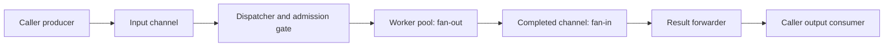

# Lesson 4 — streaming, fan-out/fan-in and backpressure

Roadmap chapters 6, 8, 9, 10, 11 and 12. Read `internal/runner/stream.go`,
`admission.go`, `stream_test.go` and `cli_stream.go`.

```powershell
Set-Location C:\Users\user\personal\dev\go\jobrunner
go run . -stream -workers 2 -jobs 8 -duration 20ms -interval 30ms
go run . -stream -jobs 6 -duration 0 -fail-first 1 -attempts 2 -jitter
go test ./internal/runner -run 'TestStream|TestAdmission|TestCancelAdmission' -v
```

On macOS (zsh or bash), adjust the path to your checkout location:

```sh
cd ~/personal/dev/go/jobrunner
go run . -stream -workers 2 -jobs 8 -duration 20ms -interval 30ms
go run . -stream -jobs 6 -duration 0 -fail-first 1 -attempts 2 -jitter
go test ./internal/runner -run 'TestStream|TestAdmission|TestCancelAdmission' -v
```

Batch RunWithOptions stores all inputs/results and returns input order. Stream
consumes jobs incrementally and emits completion order. Its input index still
identifies which job produced a result, even when output order changes. Read
TestStreamCompletionOrder: a release barrier makes job 1 complete before job 0
without relying on guessed sleep durations.

## Channel owners and pipeline stages



The caller closes input after production. The dispatcher closes its internal
work channel. A join goroutine closes completed after the dispatcher and all
workers finish. Stream returns only after that join. The caller closes output
after Stream returns; Stream itself borrows both caller channels.

Directional channel types communicate intent: <-chan Job can only receive,
chan<- Result can only send. A channel's type does not enforce who owns close;
that rule is documented and reviewed. Two closing owners can panic.

## What is bounded?

With unbuffered caller channels, a slow output consumer can cause one result to
be held by the forwarder, up to one job/result per worker, and one input job
prefetched by the dispatcher. Retained work is O(workers), independent of total
input count. Buffers chosen by the caller add their own retained items. A job's
own allocations may still be large; bounded job count is not a byte limit.

Backpressure propagates upstream: output stops, then completed sends stop,
then workers stop taking work, then dispatch stops, then the producer stops.
The CLI streaming producer allocates one demo job at a time rather than an entire
slice. Default batch mode remains useful when complete ordered results matter.

The extra forwarding result matters: with one worker and blocked output, up to
three jobs can have been consumed (one forwarded result, one worker, one prefetch).
The test checks this exact architecture rather than assuming an unbuffered
channel means no work can be in flight.

## Cancellation at every blocking boundary

Dispatcher input, admission waits, work sends, worker result sends and output
forwarding all observe the same context. A producer outside Stream belongs to
the caller and must also select on that context. A consumer that stops reading
must cancel; otherwise blocked output is expected.

On cancellation Stream may discard partial results. It joins workers rather
than waiting for a consumer to resume. This differs from the batch API, which
returns a result for every known input. A nil job in streaming input becomes an
unstarted ErrNilJob result; subsequent valid jobs continue. A nil input/output
channel is rejected because it would permanently disable communication; a closed
empty input channel is a valid completed stream.

In the CLI, a broken stdout cancels the producer and Stream, then joins both.
An arbitrary io.Writer that blocks forever is still uncooperative; context cannot
interrupt that Write. Stdout failure tests return errors rather than pretending
to model a non-returning writer.

## Admission spacing

`-interval` spaces admissions globally for this Run/Stream. The first is immediate;
later successful work-channel sends occur at least an interval apart. A slow
receiver earns no saved burst permits. Only the dispatcher owns the gate's
timestamp, so no mutex is needed.

This is a new-job admission limiter. Retry attempts inside a worker are not paced
by it, and scheduler delays mean job function starts need not be exactly spaced.
An external API request quota needs a limiter around every request attempt,
usually shared across all callers. Separate runs each have their own gate.

## Exercises

1. Compare default batch output and -stream output. Why is assigning Index at
   admission necessary when completion order changes?
2. Read the blocked-output test. Account for all three consumed jobs with one
   worker. Add a caller buffer and predict which bound changes.
3. In an isolated snippet, set a channel variable to nil in a select. That case
   becomes disabled. Closing a channel instead makes receiving immediately ready:
   explain why a loop must check the receive's ok value to avoid spinning.
4. Run many jobs with -interval 100ms and -duration 0. Increase workers: why can
   this fail to improve throughput? The dispatcher now sets the admission pace.
5. Inspect cancellation joining before removing a select's ctx.Done branch in a
   scratch copy. Use a deadline guard to expose the resulting blocked shutdown,
   then restore it. Never leave broken experiments in the normal suite.
